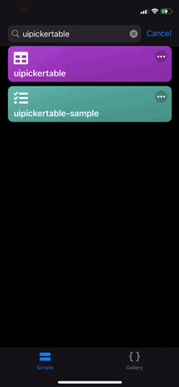

# UIPickerTable

`UIPickerTable` is a [Scriptable](https://scriptable.app) class module that extends [`UITable`](https://docs.scriptable.app/uitable/) making each row a selectable item.



---

## -new UIPickerTable

Creates an intance of a picker table.

```javascript
const UIPickerTable = importModule('uipickertable')
const table = new UIPickerTable(options)
```

### Parameters

`options` - a JSON value specifying customizations for the table.

- `multiSelect` - specifies whether the table will provide single or multiple selections. Default is `true`.
- `selectedBackgroundColor` - The color to use as the background color for selected rows. Default is `#a8a8a8`.

---

## -addRow

Overrides `UITable.addRow()` with an additional parameter to indicate if the row is selected. Default is `false`. the `selected` parameter is ignored if `.multiselect` is `false`.

```javascript
table.addRow(row: UITableRow, selected: bool)
```

### Parameters

`row` - the row to add

---

## -selections: number[]

An array containing the indices of the selected rows. The order of the indices follows the order they are selected.

```javascript
table.selections: integer[]
```

--- 

## Example

Example basic usage below. Download [uipickertable-sample.js](uipickertable-sample.js) for another example.

```javascript
const UIPickerTable = importModule('uipickertable')
const table = new UIPickerTable()

const row1 = new UITableRow()
row1.addText('hello')
row1.addText('world')
table.addRow(row1, true) // selected by default

const row2 = new UITableRow()
row2.addText('foo')
row2.addText('bar')
table.addRow(row2)

await table.present()

log(table.selections) // [0]
```

